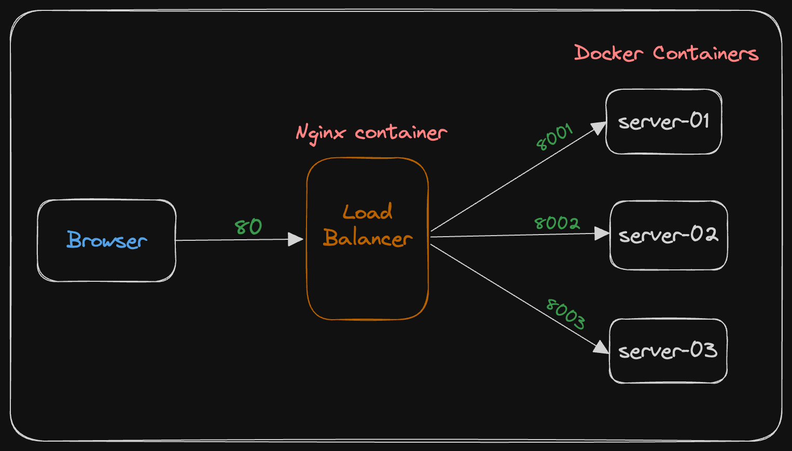

# Load Balancing with nginx

Load balancing involves effectively distributing incoming network traffic across a group of backend servers. A load balancer is tasked with distributing the load among the multiple backend servers that have been set up.

Here we will trying out nginx as a load balancer with default round robin algorithm.


### TASK

* Run three backend docker container and nginx container
* Default Load balancing three docker container with Nginx
* Weighted load balancing
* Health check (Active health check is for Nginx plus, so using passive)


### Structer

This diagram will give an overview about the system architecture




### Idea

We have created three backend server with [FastAPI](https://fastapi.tiangolo.com/), the code is very simple. All server has one endpoint and return a json response with server name.

```
{
  "message": "Hello from server 01"
}
```


### Setup & Run

Please make sure docker and docker compose is installed.

* https://docs.docker.com/engine/install/
* https://docs.docker.com/compose/install/

Run this command

```
docker-compose up --build
```

Now, goto http://localhost/ or http://localhost:80

Preview,


### Nginx Configuration


We have created a nginx.conf file that distribute request to all this three servers.

Nginx config:

```
upstream api {
    server server-01:8001;
    server server-02:8002;
    server server-03:8003;
}

server {

    listen 80;

    location / {
        proxy_pass http://api;
    }

}
```

In this case main part focus point is,

```
upstream api {
    server server-01:8001;
    server server-02:8002;
    server server-03:8003;
}
```

Here by default its using round robin algorithm to distribute the traffic. This way each request made to http://localhost is served by those three servers in a round-robin fashion.


#### Weight distribution

```
upstream api {
    server server-01:8001 weight=5;
    server server-02:8002 weight=3;
    server server-03:8003;
}
```

By default weight for each server is 1. This involves assigning a weight to each server and then distributing traffic among the servers based on these weights. This ensures that servers with more capacity receive more traffic, that helps to prevent overloading of any one server.

For example, here we set the weight of the 1st server to 5, then out of 10 requests, 5 of them (not sequentially though) are redirected to the 1st server and the rest 5 will go to the remaining servers.


#### Health Check

```
upstream api {
    server server-01:8001;
    server server-02:8002 max_fails=5 fail_timeout=30s;
    server server-03:8003;
}
```

Load balancer are often used to distribute incoming traffic among servers. Health check is important part to ensure load balancer is routing traffic correctly, it will help to identify which server is down or not functioning properly.

Nginx active health checks are available for Nginx plus.

For passive health check, to define a server unavailable we need to define `max_fails` and `failed_timeout`

max_fails: sets the number of unsuccessful attempts to communicate server that happen in the durantion set in failed_timeout

failed_timeout: the time during the specified number of unsuccessful attempts to communicate consider as unavailable.


Also we can configure nginx with *Least connection* , *Weighted least connection*, *IP Hash* etc.

To check more configuration,

* https://nginx.org/en/docs/http/load_balancing.html
* https://docs.nginx.com/nginx/admin-guide/load-balancer/http-load-balancer/


Resources:

* https://www.nginx.com/resources/glossary/load-balancing/
* https://www.nginx.com/resources/glossary/round-robin-load-balancing/
* https://www.iankumu.com/blog/nginx-load-balancing/